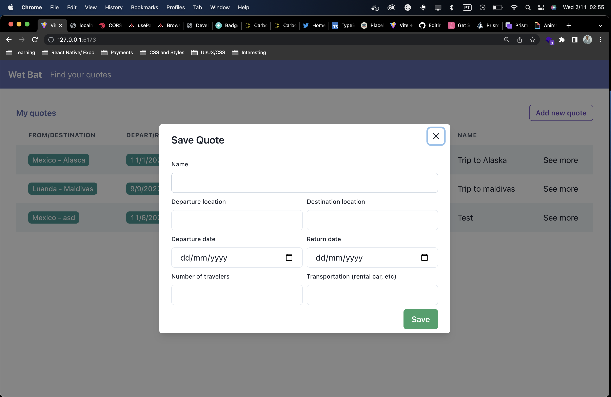
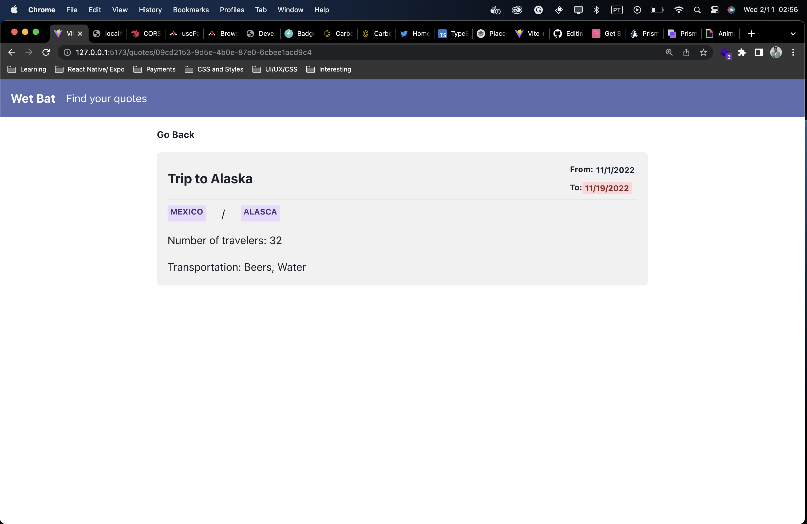

# WetBat Front End Test

- Create and manage quotes





## Tech stack
- [ReactJS](https://beta.reactjs.org/)
- [Typescript](https://www.typescriptlang.org/docs/handbook/typescript-in-5-minutes.html)

## Some features
- Optimistic updates
- High Form validation
- Caching server data


# SetUp

This we app was made with [Vitejs](https://vitejs.dev/guide/), for more details take a look at the documentation.

You need to install:

>You've Probably already installed it

- [NodeJS](https://nodejs.org/en/)
- [Yarn](https://yarnpkg.com/)  #optional (you can use npm)


# How to run

> Att: this web app needs a backend, I've already built that, so go [setup the API](https://github.com/jmamadeu/wetbat-travel-backend)

Clone the repo using `https, ssh or even github-cli`.

Create `.env.local` file and add `VITE_BASE_API_URL=http://localhost:3000/api/v1` which is the default API endpoint.

> Since this app was built with `vite.js` it'll run at [http://127.0.0.1:5173/](http://127.0.0.1:5173/) by default

```bash
$ yarn # To install the dependencies
$ yarn dev # run the project
```

# Contributions
- Feel free to open a `PR`

Made with :heart: by [João Amadeu](https://twitter.com/jmamadeu), feel free to DM me.
