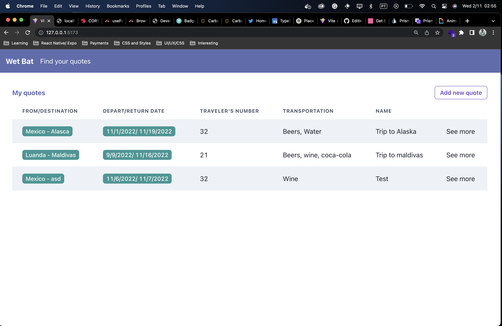

# WetBat Front End Test

- Create and manage quotes




## Tech stack
- [React]
- [Typescript](https://www.typescriptlang.org/docs/handbook/typescript-in-5-minutes.html)

## Design
You can find the [figma design here](https://www.figma.com/file/m9IyJJrhadeUoPqxxXbDnS/ToDo-List-(Copy))

# How to run

To run this web app you must need to install

>You've Probably already installed it

- [NodeJS](https://nodejs.org/en/)
- [Yarn](https://yarnpkg.com/) Optional
- [Expo](https://docs.expo.dev/get-started/installation/)

`Clone the repo` using `https, ssh or even cli` it's up to you, once you clonned it

```bash
$ yarn # To install the dependencies
$ cd ios && pod install & cd .. # To install pods
$ npx expo start # to run the app
```

> If you want to run it with your phone, you need to install `Expo Go`, you can find on `App Store` or `Play Store`

Made with :heart: by [João Amadeu](https://twitter.com/jmamadeu), feel free to reach me out.
